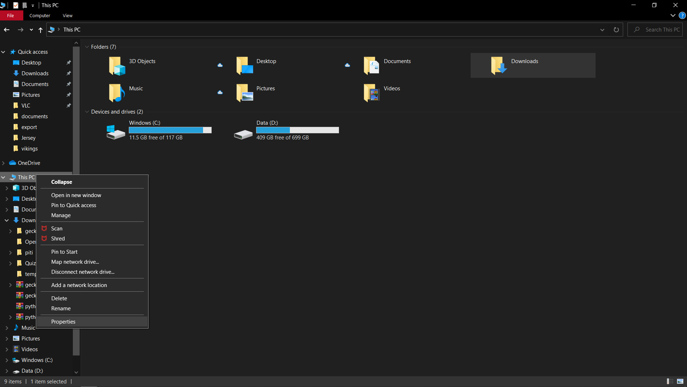
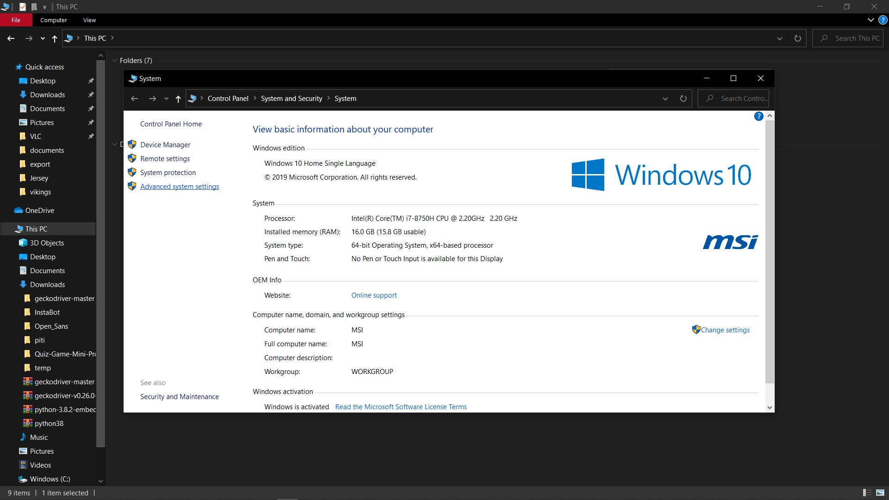
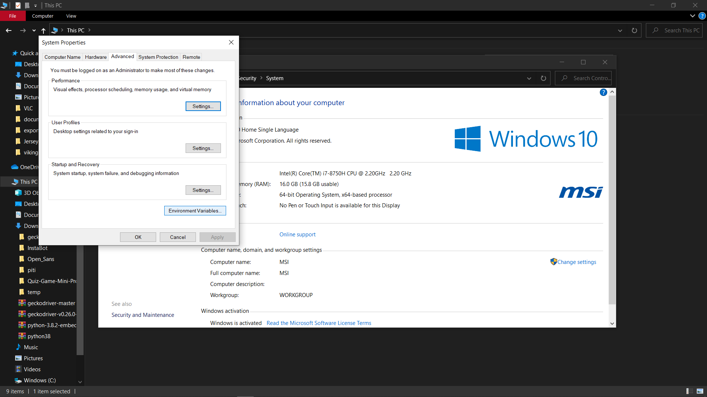
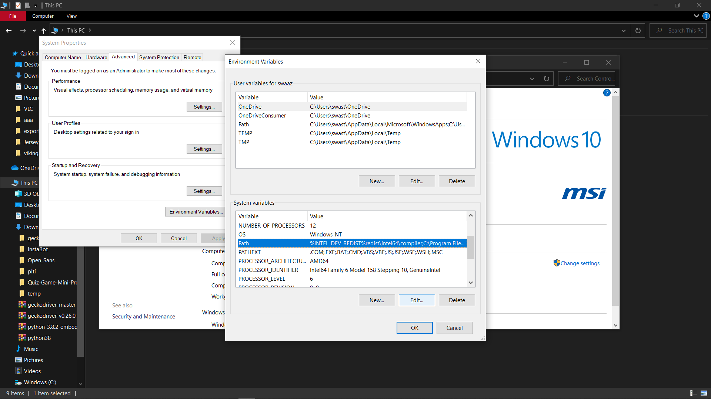
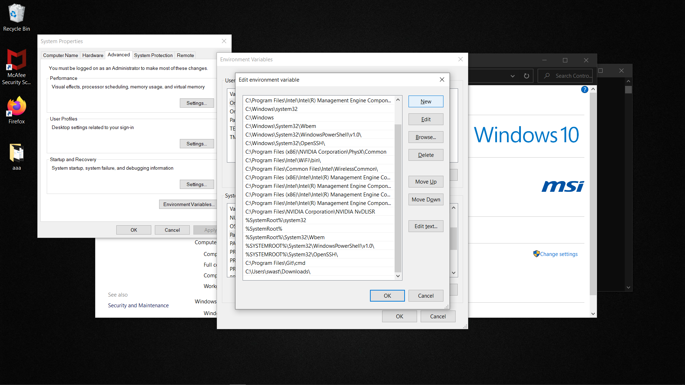

<h1 align="center"> InstaBot</h1>
<h2 align="center"> Bot built for Instagram using Python and Selenium. </h2>
<h3 align="center"> 
This is an Instagram bot that can automate and perform some tasks; makes your task easier. The Bot can show the list of un-followers from you Instagram or it can show your fans and also it can cancel all the pending follow requests which you have already sent before or it can aslo unfollow those who don't follow you back.
</h3>
<div align="center">
    
</div>

### Clone project
First you need to fork and then copy the url from clone option  
Run in gitbash or terminal :
```
$ git clone [url]
```
### Install Python 3
run in terminal :
```
$ sudo apt-get update
$ sudo apt-get install python3.7
```
### Install PIP
#### For Windows user
- Download the ```git-pip.py``` by clicking [here](https://bootstrap.pypa.io/get-pip.py)
- Run in gitbash or cmd :
```
$ python get-pip.py
```
- Verify by running :
```
$ pip -V
```
#### For linux user
- Run in terminal :
```
$ apt install python3-pip
or
$ python get-pip.py     
```
### Install Selenium
Run in terminal or cmd / gitbash
```
$ pip install selenium
or
$ pip3 install selenium
```
### Add the Path to the code
The path of the webdriver has to changed according to your environment  
Replace 18ₜₕ line of file  ``` ./program.py ``` with the code snippet given below
#### linux user
##### if you are using firefox
```
self.driver = webdriver.Firefox(executable_path = "./webdrivers/firefox_webdriver/geckodriver-v0.26.0-linux64/geckodriver")
```
##### if you are using chrome

```
self.driver = webdriver.Chrome(executable_path = "./webdrivers/chrome_webdriver/chromedriver_linux64/chromedriver")
```
#### Windows user
##### if you are using firefox

```
self.driver = webdriver.Firefox(executable_path = ".\\webdrivers\\firefox_webdriver\\geckodriver-v0.26.0-win32\\geckodriver.exe")
```

##### if you are using chrome

```
self.driver = webdriver.Chrome(executable_path = ".\\webdrivers\\chrome_webdrive\\chromedriver_win32\\geckodriver.exe")
```  
### Adding Path to the Environment Variable (only for Windows users)
<strong> Read the Instruction carefully </strong>

#### Instructions to add path to your Environment variable
- Copy the path of webdriver which is inside ```InstaBot``` folder and add the path to Environment Variable as instructed below
##### if you are using firefox
Begining of the path will depend on your system and the location you cloned the repo
```
.....\InstaBot\webdrivers\firefox_webdriver\geckodriver-v0.26.0-win32\
```
example : 
```
C:\Users\sharan\Downloads\temp\InstaBot\webdrivers\firefox_webdriver\geckodriver-v0.26.0-win32\
```
##### if you are using chrome
Begining of the path will depend on your system and the location you cloned the repo
```
.....\InstaBot\webdrivers\chrome_webdriver\chromedriver_win32\
```
example : 
```
C:\Users\sharan\Downloads\temp\InstaBot\webdrivers\chrome_webdriver\chromedriver_win32\
```
- Then go to ```This PC``` -> Right-click -> Properties -> Advanced system setting -> Advanced -> Environment Variables -> User system -> select ```path``` -> Edit -> New -> Paste the copied path -> OK  
##### Above instrution in show below
<div align="center">
    <div><div><br>
    <div><div><br>
    <div><div><br>
    <div><div><br>
    <div><div><br>
    <div><div><br>
</div>  
<strong>How to add Firefox webdriver path to environment variable</strong>

[](https://youtu.be/wtiq5FX9lxE "Add firefox webdriver path")

<strong>How to add chrome webdriver path to environment variable</strong>

[](https://youtu.be/mxVfa6q-03M "Add chrome webdriver path")

<div align="left">


#### file structure:
```
.
├── webdriver
│   │
│   ├── chrome_webdriver
│   │   ├── chrome_webdriver_linux64
│   │   │   ├── chromedriver
│   │   │   
│   │   ├── chrome_webdriver_mac64
│   │   │   ├── chromedriver
│   │   │  
│   │   ├── chrome_webdriver_win32
│   │   │   ├── chromedriver.exe
│   │
│   │
│   ├── firefox_webdriver
│   │   ├── geckodriver-v0.26.0-linux64
│   │   │   ├── geckodriver
│   │   │   
│   │   ├── geckodriver-v0.26.0-macos
│   │   │   ├── geckodriver
│   │   │   
│   │   ├── geckodriver-v0.26.0-win32
│   │   │   ├── geckodriver.exe
│   │   │
│   │
│   
```
### Add username and password
Edit the ```./secrets.py``` file and add your username and password
```
usr = "[username]" 
pwd = "[password]"
```

### Run the program
Run in terminal or cmd / gitbash
```
$ python program.py
or
$ python3 program.py
```
### Helpful links
- [Install Python 3](https://realpython.com/installing-python/)
- [Installing PIP on Windows](https://www.liquidweb.com/kb/install-pip-windows/)
- [Installing PIP on Linux](https://www.tecmint.com/install-pip-in-linux/)
- [Download Geckodriver](https://github.com/mozilla/geckodriver/releases)
- [Download Chrome Driver](https://chromedriver.chromium.org/downloads)
- [Setup selenium and webdriver for Linux](https://www.youtube.com/watch?v=CriSHYMtg9M)
- [Setup selenium and webdriver for Windows](https://youtu.be/FFDDN1C1MEQ)

### Contributers
- [Swaaz](https://github.com/swaaz/)
- [JBLew](https://github.com/autumnlewjb)